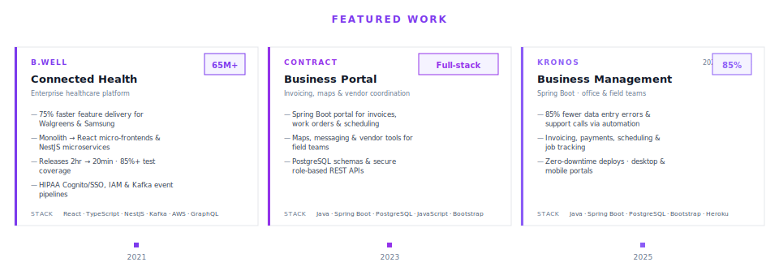

<!-- Animated waving header -->

<!-- Typing animation -->

  

  
  &nbsp;
  

---

## About Me

Senior Software Engineer with **5 years of experience** building HIPAA-compliant enterprise healthcare platforms — secure distributed systems, React micro-frontends, NestJS microservices, and event-driven apps serving **65M+ users**.

Currently at **Kronos**, building **Java/Spring Boot business portals** for desktop and mobile to streamline workflows for office and field teams.

- 🏥 **B.well Connected Health** — Modernized a monolithic platform into React micro-frontends and NestJS microservices, cutting feature delivery time by **75%** for clients like Walgreens and Samsung
- 🔐 Strengthened security with **AWS Cognito, SSO, IAM**, and HIPAA-aligned access controls across distributed REST/GraphQL and **Kafka** event workflows
- ⚡ Improved release velocity from ~2 hours to **~20 minutes** with GitHub Actions, **85%+ test coverage**, and monitoring via Datadog & Grafana
- 🏗️ At **Kronos**, building invoicing, payments, scheduling, and job-tracking systems — reducing data entry errors and calls/emails by **85%** through automation
- 📱 Developing responsive **Bootstrap/JavaScript** frontends for field use, with **PostgreSQL** schemas and secure REST APIs with role-based permissions
- 🔗 **[linkedin.com/in/hannahpaterka](https://linkedin.com/in/hannahpaterka)**

---

## Tech Stack

<!-- City skyline built from your GitHub contributions -->

  

<!-- Primary stack -->

  

<!-- Extended stack tiles -->

  

  REST • SQL • FHIR • i18n • WCAG / ARIA

---

## Project Timeline

<!-- Visual timeline — building heights reflect project scale -->

  

 

<!-- ── B.well ── -->
<h3 align="center">🏥 B.well Connected Health · 2021 – 2025</h3>

<strong>Enterprise healthcare platform</strong> — React micro-frontends & NestJS microservices

  
  
  
  

  

  

Modernized monolith → micro-frontends · HIPAA-aligned AWS Cognito/SSO · Kafka event workflows

 

<!-- ── Contract Business Portal ── -->
<h3 align="center">🏗️ Business Portal · Contract · 2023 – 2024</h3>

<strong>Client operations portal</strong> — invoicing, work orders, maps & vendor coordination

  
  
  

  

  <a href="https://github.com/hannahpaterka/busines-portal-readme">📁 busines-portal-readme</a>

 

<!-- ── Kronos ── -->
<h3 align="center">🏢 Kronos · 2025 – Present</h3>

<strong>Spring Boot business-management system</strong> — invoicing, payments, scheduling & job tracking

  
  
  

  

PostgreSQL schemas · secure REST APIs · role-based permissions · Heroku production ops

---

## Connect

  
  

