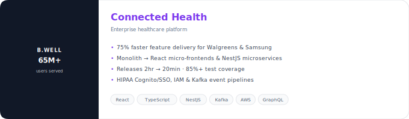
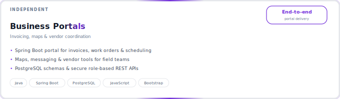
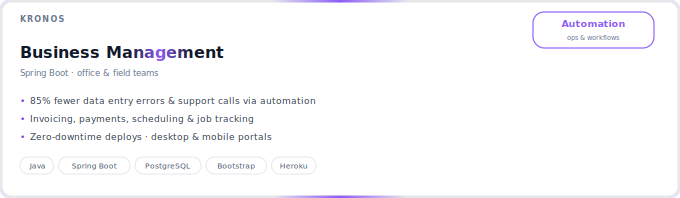

<!-- Header -->

  
  

<!-- City skyline — stat squares + contribution graph -->

  

<h2 align="center">Tech</h2>

  

<h2 align="center">About Me</h2>

  

<h2 align="center">Featured Work</h2>

<!-- Project cards — linked titles open website or repo -->

  
   
  
   
  

