<!-- Animated waving header -->

<!-- Typing animation -->

  

  
  &nbsp;
  

---

## About Me

I'm a developer focused on building clean, responsive web apps — from interactive frontends to full client portals.

- 🔭 Recently built **[nyc-bike-dash](https://github.com/hannahpaterka/nyc-bike-dash)** (Vue) and **[bloom-coffee](https://github.com/hannahpaterka/bloom-coffee)**
- 💻 Stack: **Vue**, **JavaScript**, **CSS**, HTML, Bootstrap, jQuery
- 🌱 Always refining UI/UX and modern frontend patterns
- 💬 Ask me about frontend dev, APIs, and responsive design
- 🔗 **[linkedin.com/in/hannahpaterka](https://linkedin.com/in/hannahpaterka)**

---

## GitHub Stats

<!-- Generated by .github/workflows/update-stats.yml — includes public + private repos -->

  
  &nbsp;
  

  

  

---

## Tech Stack

  
  
  
  
  
  

---

## Featured Projects

| Project | Stack | Description |
|---------|-------|-------------|
| [nyc-bike-dash](https://github.com/hannahpaterka/nyc-bike-dash) | Vue | NYC bike data dashboard |
| [bloom-coffee](https://github.com/hannahpaterka/bloom-coffee) | — | Coffee shop ordering app (code exercise) |
| [busines-portal-readme](https://github.com/hannahpaterka/busines-portal-readme) | — | Client portal for invoices, work orders & ops |
| [WeatherApp](https://github.com/hannahpaterka/WeatherApp) | JS | Weather app with radar, Mapbox & OpenWeatherMap |
| [Konami](https://github.com/hannahpaterka/Konami) | CSS | Fun CSS + jQuery Konami code easter egg |

---

## Connect

  
  

<!-- Footer wave -->

