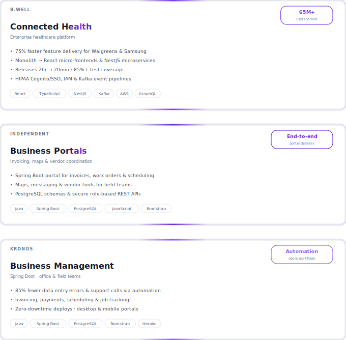

<!-- Header -->

  
  

<!-- City skyline — stat squares + contribution graph -->

  

## Tech

<b>Frontend & UI</b>

  
  
  
  
  
  
  
  
  
  

<b>Backend & APIs</b>

  
  
  
  
  
  
  
  

<b>Data & Messaging</b>

  
  
  
  

<b>Cloud & DevOps</b>

  
  
  
  
  
  

<b>Testing & Quality</b>

  
  
  
  
  
  
  

<b>Tools & Mobile</b>

  
  
  
  
  
  

## About Me

Senior Software Engineer with **5 years of experience** building HIPAA-compliant enterprise healthcare platforms — secure distributed systems, React micro-frontends, NestJS microservices, and event-driven apps serving **65M+ users**.

Currently at **Kronos**, building **Java/Spring Boot business portals** for desktop and mobile to streamline workflows for office and field teams.

- 🏥 **B.well Connected Health** — Modernized a monolithic platform into React micro-frontends and NestJS microservices, cutting feature delivery time by **75%** for clients like Walgreens and Samsung
- 🔐 Strengthened security with **AWS Cognito, SSO, IAM**, and HIPAA-aligned access controls across distributed REST/GraphQL and **Kafka** event workflows
- ⚡ Improved release velocity from ~2 hours to **~20 minutes** with GitHub Actions, **85%+ test coverage**, and monitoring via Datadog & Grafana
- 🏗️ At **Kronos**, building invoicing, payments, scheduling, and job-tracking systems — reducing data entry errors and calls/emails by **85%** through automation
- 📱 Developing responsive **Bootstrap/JavaScript** frontends for field use, with **PostgreSQL** schemas and secure REST APIs with role-based permissions

<h2 align="center">Featured Work</h2>

<!-- Single full-width stack — click regions map to project links -->

  
  <map name="featured-work-map">
    <area shape="rect" coords="0,0,680,216" href="https://www.icanbwell.com/" alt="Connected Health" />
    <area shape="rect" coords="0,244,680,442" href="https://github.com/hannahpaterka/busines-portal-readme" alt="Business Portals" />
  </map>

