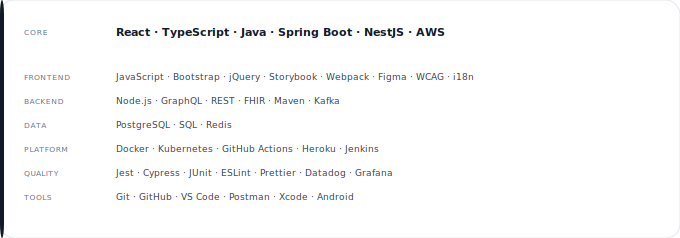
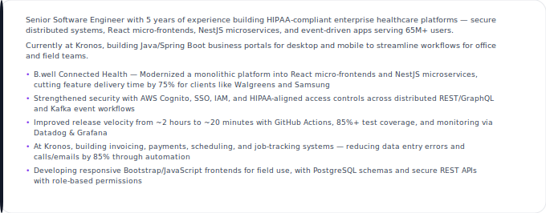

<!-- Header -->

  
  

<!-- City skyline — stat squares + contribution graph -->

  

<h2 align="center">Tech</h2>

  

<h2 align="center">About Me</h2>

  

<h2 align="center">Featured Work</h2>

<!-- Single full-width stack — click regions map to project links -->

  
  <map name="featured-work-map">
    <area shape="rect" coords="0,0,680,198" href="https://www.icanbwell.com/" alt="Connected Health" />
    <area shape="rect" coords="0,198,680,378" href="https://github.com/hannahpaterka/busines-portal-readme" alt="Business Portals" />
  </map>

